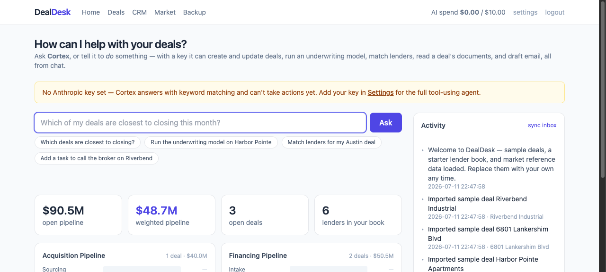
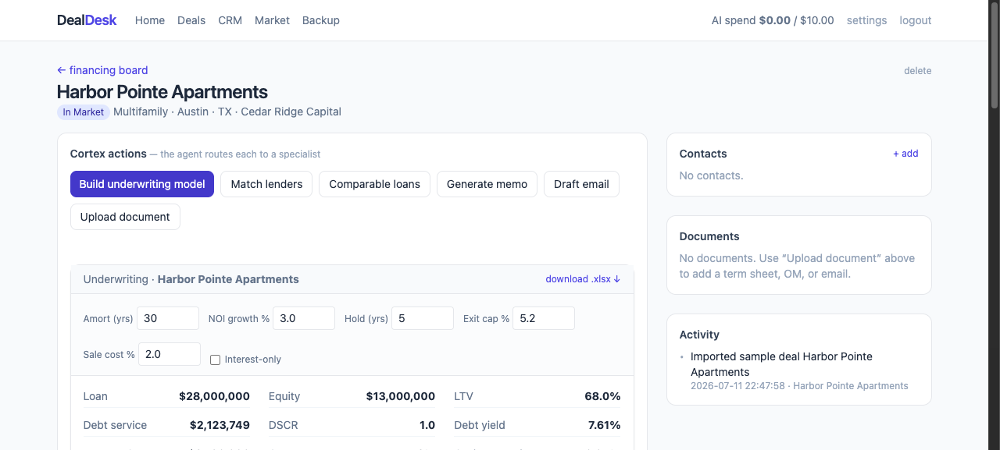
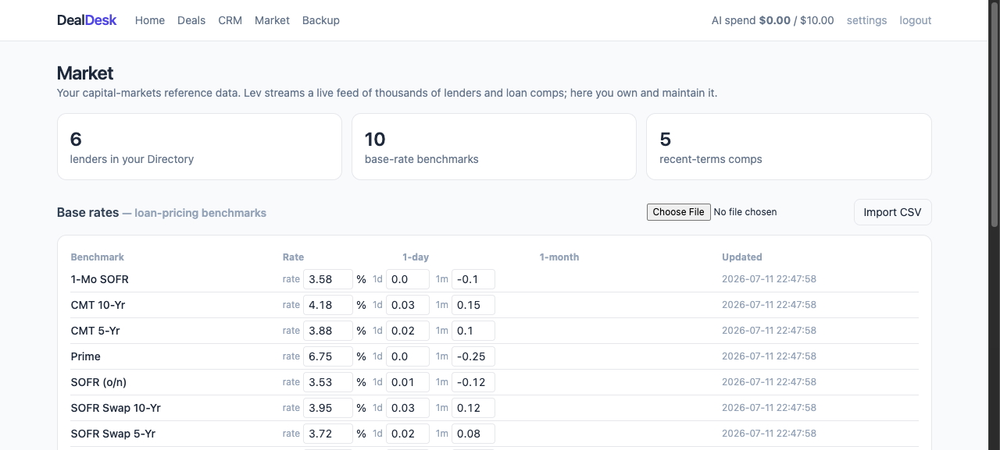
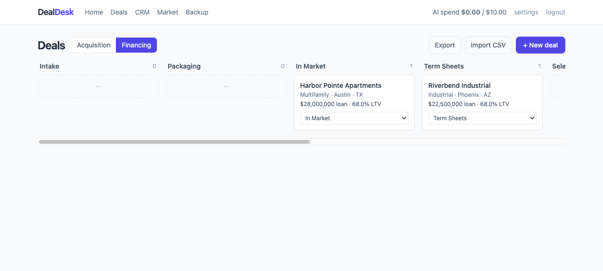
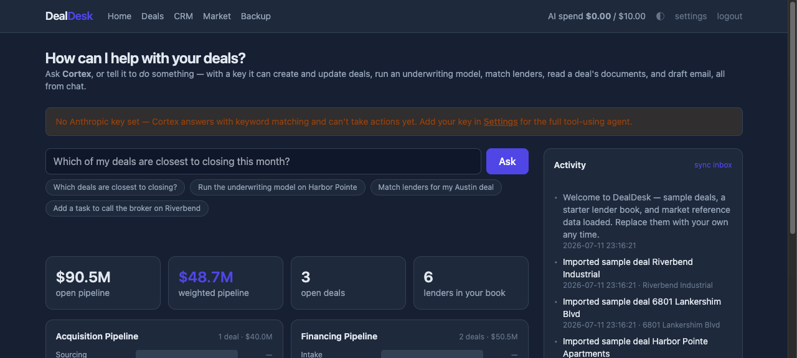

# DealDesk

[](https://github.com/dweng1572179/dealdesk/actions/workflows/ci.yml)

Self-hosted, AI-native **commercial-real-estate deal workspace** — a
bring-your-own-keys, own-it alternative to [Lev](https://www.lev.com). **Cortex**,
an AI agent over your deals; a CRM with pipeline boards, contacts, and companies;
a **dashboard** with weighted pipeline and per-stage totals; **placements** (which
lenders you shopped a deal to); term extraction and a document vault; an **Excel
underwriting-model builder**; lender matching and market reference data against your
own book; CSV import/export and one-click backup; and an email loop — all on one
small FastAPI service and a single SQLite file. No SaaS, no per-seat pricing, your
data stays on your box.

## Screenshots

**Dashboard** — Cortex agent, weighted pipeline, per-stage $ charts, activity feed:



**Deal detail** — the Cortex action bar and a live underwriting model (DSCR, debt yield, exit cap, IRR):



**Market** (capital-markets reference — your lender directory, base rates, closed-loan comps) and the **pipeline board** with per-card stage moves:




**Dark mode** (toggle in the header or press `d`; `?` shows all keyboard shortcuts):



## 60-second setup

```bash
git clone https://github.com/dweng1572179/dealdesk && cd dealdesk
python3 -m venv .venv && source .venv/bin/activate
pip install -r requirements.txt
cp .env.example .env                 # set DEALDESK_PASSWORD (your login password)
./run.sh                             # → http://localhost:8799, log in, done
```

That's the whole install — no database to provision, no services to wire up. First run
seeds sample deals, a starter lender book, and market data so every screen has
something in it. **Everything works with zero API keys**; add an Anthropic key in
**Settings** (in the browser, applied live) to turn on the real agent, term
extraction, and drafting. Non-technical? Double-click **Start DealDesk**
(`.command` on Mac, `.bat` on Windows) instead.

It shares its architecture with OpenProp (a sibling self-hosted app): one service,
one password, free by default, paid AI only when you use it (metered against a
monthly cap).

## What it does (and how it maps to Lev)

| Lev | DealDesk |
| --- | --- |
| "Cortex" multi-agent router (chat over deals/files) | **Cortex** — a tool-using agent over your deals: from chat it creates/updates deals, runs an underwriting model, matches lenders, reads a deal's docs, and drafts email (one BYO model + tools, not a multi-model system) |
| Build Excel underwriting models (pro forma, DSCR, debt sizing) | **Build underwriting model** → a real `.xlsx` (sources/uses, debt sizing, DSCR, pro forma) from the deal, no key needed |
| Term extraction from documents (~95%) | Upload a term sheet/OM → structured terms → apply to the deal |
| Market moat: 7,287 lenders · 34 base rates · 16,133 loan comps | **Market** page — your own lender Directory, Base rates, and Recent-terms comps (seeded, then edit/import) |
| Lender matching | Match a deal to **your own** lender book; scored + explained |
| Placements (where a deal was shopped) | **Placements** on every deal — shop it to matched lenders, track status + terms |
| CRE CRM: deals, contacts, companies, pipelines | Deals with Acquisition/Financing boards; contacts↔companies↔deals; tasks; CSV import |
| Home dashboard / pipeline insights | **Dashboard** — weighted pipeline, $ per stage, deal counts, theme-aware charts |
| Deal document vault | **Files vault** — upload, extract terms, then view/download the original |
| Export / reports | Deals·lenders·contacts·comps → **CSV**; one-click **SQLite backup/restore** |
| Email microservice (Gmail/Outlook OAuth) | Stdlib IMAP/SMTP — connect any inbox with an App Password; test-connection button |
| Pusher realtime feed | An activity feed the page polls every 15s |
| Metronome + Stripe usage credits | A local monthly AI-spend cap |
| Next.js + GraphQL microservices, Auth0, PostHog/Segment/Sentry | One FastAPI app, one password, no telemetry |

Everything AI degrades to a **rules/template fallback** with no Anthropic key, so
the CRM, boards, underwriting models, matching, market data, and CSV import all
work with zero keys.

## Run

Non-technical? Double-click **Start DealDesk** (`.command` on Mac, `.bat` on
Windows) — it builds the venv on first run and opens the browser. Docker not
needed; Windows only needs Python from python.org.

```bash
python3 -m venv .venv && source .venv/bin/activate
pip install -r requirements.txt
cp .env.example .env          # set DEALDESK_PASSWORD (a login password)
./run.sh                      # http://localhost:8799
```

`./run.sh` defaults to port **8799**; change it with `DEALDESK_PORT=9000 ./run.sh`.
Docker is optional (`docker compose up` — same port, persists the DB in a volume).

Then open **http://localhost:8799**, log in, and go to **Settings**. Paste your keys
right in the browser and hit Save — they apply immediately (no restart, no file
editing). The only thing that belongs in `.env` is `DEALDESK_PASSWORD` (and optionally
`SECRET_KEY`).

- **Anthropic key** → the agent, term extraction, email/memo drafting, lender pros/cons.
  Without it these fall back to keyword search, regex extraction, and templates.
- **Email address + App Password** → sync your inbox into the activity feed and send
  from a deal. Gmail/Outlook require an *App Password*, not your login password.
- **Monthly AI cap** → refuses paid AI calls past the cap; a running total sits in the header.

First run seeds three sample deals, a starter lender book, and market reference
data (base rates + loan comps) so everything works immediately — replace them with
your own any time (CRM → Lenders, or Market → Import CSV).

## Underwriting models

On any deal, **Cortex actions → Build underwriting model** derives a lender-grade
model from the deal's fields — fills the gaps (NOI from price×cap, loan from
price×LTV), sizes the debt (amortizing or interest-only), and computes DSCR, debt
yield, cash-on-cash, and a multi-year pro forma. Tune the amortization, NOI growth,
hold, and interest-only assumptions inline, then **download `.xlsx`**. Pure finance
math — no Anthropic key required.

## Market data

**Market** is your capital-markets reference set (the open answer to Lev's feed of
7,000+ lenders / 16,000+ loan comps / 34 rate benchmarks — you own and maintain it):
your lender **Directory**, **Base rates** (loan-pricing benchmarks), and **Recent
terms** (closed-loan comps). Seeded on first run; import your own via CSV:

```
# base rates:   name,value,delta_1d,delta_1m
# recent terms: asset_type,state,loan_purpose,capital_provider,ltv,rate,term_years,amort_years,recourse,issued,notes
```

## Lender CSV format

Columns (header row required; extra columns ignored; upsert by `name`):

```
name,contact_name,email,phone,loan_types,property_types,geographies,min_loan,max_loan,max_ltv,appetite,notes
Agency Shop,Pat Lee,pat@agency.com,,acquisition;refinance,Multifamily,US,5000000,75000000,80,active,DUS lender
```

List columns (`loan_types`, `property_types`, `geographies`) are comma- or
semicolon-separated. `geographies` are 2-letter states, or `US` for national.

## Checks

```bash
python -m tests.test_smoke   # end-to-end HTTP: auth, deals, board, agent, upload, match, underwriting+xlsx, market, CRM, settings
python -m tests.test_units   # ai / matching / underwriting / docparse / inbox / budget self-checks
```

Both run with no keys and no network (every AI/email path exercises its fallback).

## Layout

```
app/
  app.py            FastAPI app, auth, dashboard
  config.py         .env settings
  db.py             SQLite schema + persistence (deals, contacts, companies, lenders, docs, tasks, activity, market data)
  models.py         pipelines/stages + the LLM term-extraction schema
  budget.py         AI spend meter + monthly cap
  ai.py             Cortex agent · term extraction · drafting · memo · match rationale (rules fallback)
  underwriting.py   deterministic Excel model builder (DSCR / debt sizing / pro forma)
  inbox.py          stdlib IMAP fetch + SMTP send
  docparse.py       PDF / .docx / text extraction
  matching.py       local lender scoring
  csvimport.py      one robust CSV reader for every importer
  settings_store.py DB-overrides-.env live settings + app flags
  seed.py           first-run sample deals + lender book + market data (once, via a sentinel)
  routes_*.py       deals · crm · agent · files · market · placements · inbox · settings · export
  templates/        Jinja + HTMX + Tailwind (CDN)
```

## Continuous integration

Both suites run on every push/PR (Python 3.11–3.13) with **no keys and no network** —
see [`.github/workflows/ci.yml`](.github/workflows/ci.yml). If it's green, the whole
app works offline on a clean checkout.

## Security & self-hosting

DealDesk is a **single-user** app: one password, a signed-session cookie, no accounts.
That keeps it simple; it also sets the security model. Before exposing it beyond
localhost:

- **Set `DEALDESK_PASSWORD`** to something real (the login is rate-limited — 8 failed
  attempts per IP in 5 minutes returns `429` — to blunt brute-forcing).
- **Set `SECRET_KEY`** in `.env` so sessions survive restarts (otherwise a random key is
  generated each boot and everyone is logged out).
- **Put it behind HTTPS** (a reverse proxy — Caddy or nginx — terminates TLS) and set
  `SESSION_HTTPS_ONLY=true`, which adds the `Secure` flag to the session cookie.
- The session cookie is **`SameSite=Lax`**, so browsers don't attach it to cross-site
  `POST`s — that's the CSRF control for the app's mutations. It's also `HttpOnly`.
- **The SQLite DB holds your Anthropic key and email App Password in cleartext** (same as
  `.env`). DealDesk `chmod 0600`s the DB file; keep the box (and the Docker volume) private.

```bash
docker compose up        # → http://localhost:8799, DB persisted in a named volume
```

This is deliberately built for **one trusted user on their own box**. Exposing it to
untrusted or multiple users is out of scope — that's where you'd add per-request CSRF
tokens, real accounts, and audit logging. The single-user shape is the point, not an
oversight.

## What DealDesk deliberately is not

Lev's moat is a **live proprietary capital-markets feed** (real-time pricing and
appetite from 7,000+ lenders, 16,000+ loan comps, 34 rate benchmarks) plus a
server-side multi-model "Cortex" and a sales-led B2B stack. DealDesk has **no live
feed** — its Market runs on data *you* seed and maintain, and Cortex is one BYO
model with a rules fallback. That's the honest trade: you own the data, the model
key, and the deployment, instead of renting the intelligence Lev sells as a
metered subscription.
